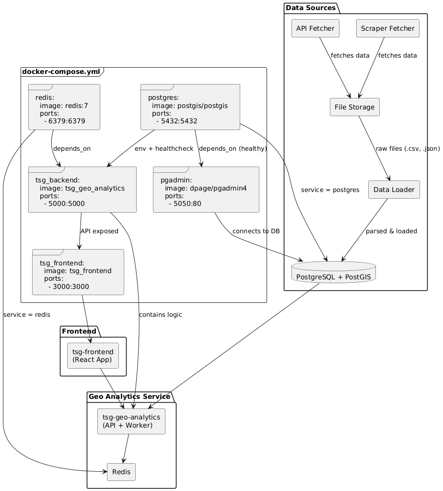

# Architecture Overview

This document provides an architectural overview of the application, outlining the key components and how they interact to deliver functionality.

## Frontend Architecture

The frontend is built using **React** and **Mapbox** to render interactive maps and handle user interactions.

### Key Components:

- **Sidebar.js**: The sidebar component provides a navigation panel to interact with the map, perform searches, and trigger spatial queries.
- **MapboxComponent**: This component integrates Mapbox to render geographical data on the map. It provides map features like zoom, panning, and interactive overlays.
- **Search**: A search component allows users to search for counties, and states geographical entities.
- **Spatial Queries**: The frontend supports spatial queries such as querying nearby cities, searching boundaries, and showing demographic results on the sidebar.

### Workflow:

1. The user interacts with the Mapbox map through the `MapboxComponent`.
2. The `Sidebar.js` allows the user to input search criteria or request spatial queries and shows demo-graphical data.
3. The frontend sends requests to the Flask API to fetch the required data, which is displayed dynamically on the map.

## Backend Architecture

The backend is structured using **Python** with **Flask** as the web framework and **SQLAlchemy** for database management. It handles tasks like data scraping, loading data, geospatial queries, and providing API endpoints for the frontend.

### Key Components:

#### 1. **Data Extraction and Loading**

- **app/services/scraper.py**:
  - **fetch_page(url)**: Fetches HTML content from a given URL.
  - **parse_quickfacts_table(html)**: Parses and extracts data from the QuickFacts table.
  - **clean_data(df)**: Cleans and processes the scraped data into a usable format.
  - **main()**: Orchestrates the scraping process and saves the cleaned data.

- **app/scripts/load_geographical_data.py**:
  - Handles the loading of geographical data, such as boundaries, into the database.

- **app/scripts/load_demographic_data.py**:
  - Loads demographic data (e.g., state and county data) from CSV files into the database.
  - **load_state_data(csv_file, year)**: Loads state-level demographic data.
  - **load_county_data(csv_file, year)**: Loads county-level demographic data.
  - **load_data_for_all_years()**: Loads data for multiple years.
  - **generate_csv_files()**: Generates CSV files from the scraped data.

- **app/scripts/load_data.py**:
  - Orchestrates the loading of both geographical and demographic data.
  - **calculate_centroids_lat_lng()**: Calculates latitude and longitude for city centroids.

- **app/services/database.py**:
  - Manages database connections and provides access to the database using **SQLAlchemy**.
  - Defines models like **City**, **County**, **State**, **StateDemography**, and **CountyDemography**.

- **app/models/entities.py**:
  - Defines the database schema for entities, using **GeoAlchemy2** for geospatial data types (e.g., points, polygons).

- **app/utils/geo_utils.py**:
  - Provides utility functions such as **to_geojson_from_wkb(wkb_element)** to convert WKB (Well-Known Binary) geometry to **GeoJSON** format.

#### 2. **Caching**

👉 [**View Cache Overview**](https://github.com/ShivaKumarSanapala/tsg_geo_analytics/blob/dev/docs/redis_cache.md)

- **app/services/cache.py**:
  - Manages Redis caching for geospatial data.
  - **init_redis(app)**: Initializes the Redis client.
  - Defines cache keys for storing city data, state boundaries, and county boundaries (e.g., `city_data_key(geoidfq)`, `geojson_state_key(geoidfq)`).
  - **load_cities_to_redis_from_db()**: Loads city data into Redis to speed up geospatial queries.

- **app/routes/data_api.py**:
  - Defines API endpoints related to demographic data and caching, including **load_cities_to_redis()**, which loads city data from the database to Redis.

- **app/routes/health_check.py**:
  - Provides endpoints for health checks, such as **ping_redis()** to check Redis connectivity.

---

## 🔍 Key API Endpoints

### **1. Demographics**
- **`GET /demographics?lat={lat}&lng={lng}`**
  - Fetch demographic info for location.
  - Returns: State and county data.

---

### **2. Nearby Cities**
- **`GET /nearby?lat={lat}&lng={lng}&radius=50000&page=1&limit=10`**
  - Query nearby cities using PostGIS.
- **`GET /nearby-redis?lat={lat}&lng={lng}&radius=50000&page=1&limit=10`**
  - Same as above but via Redis (faster lookup).

---

### **3. Cities Within Polygon**
- **`POST /query_cities_within_polygon`**
  - Body: GeoJSON polygon.
  - Returns cities contained within polygon.

---

### **4. Encompassing Boundaries**
- **`GET /encompassing_boundaries?geoidfq={id}&page=1&limit=10`**
  - Returns parent boundaries (e.g., state containing a city).

---

### **5. Search Boundaries**
- **`GET /search?boundaryType=states|counties&query={name}`**
  - Autocomplete-like search for states/counties.

---

### **6. Redis Loader**
- **`POST /load-cities-to-redis`**
  - Loads all cities into Redis cache.

---

### **7. Health Checks**
- **`GET /health`**
- **`GET /health/ping_db`**
- **`GET /health/ping_redis`**
  - Status endpoints for monitoring.

---

## 🧬 Core Database Models

### **StateDemography / CountyDemography**
- Fields:
  - `total_population`, `median_gross_rent_in_dollars`, `median_household_income_past12months`
  - Education: `male_bachelors_degree_25yrs_above`, `female_bachelors_degree_25yrs_above`
  - `year`, `state`, `county`, `geoidfq`

---

### **City / County / State / ZCTA**
- Common Fields:
  - `name`, `geoid`, `geoidfq`, `wkb_geometry` (Geo type)
  - `centroid_lat`, `centroid_lon` (for City)
  - `aland`, `awater` (land/water area)

---

#### 5. **Application Setup**

- **app/__init__.py**:
  - Initializes the Flask application, sets up the database connection, and registers the API blueprints.

- **app/main.py**:
  - The entry point to run the Flask application.

- **app/config.py**:
  - Loads environment variables using **dotenv** for configuration (e.g., database credentials, API keys).

## Key Technologies

- **Python**: Used as the backend programming language.
- **Flask**: Lightweight web framework to serve the backend API.
- **SQLAlchemy**: ORM for managing the database and interacting with PostgreSQL/PostGIS.
- **PostgreSQL/PostGIS**: Relational database with spatial extensions to handle geographical data.
- **Redis**: Caching layer to speed up geospatial queries and data retrieval.
- **GeoAlchemy2**: Extension for SQLAlchemy to handle geospatial data types.
- **BeautifulSoup**: For parsing and scraping data from web pages.
- **Pandas**: For processing and cleaning data.